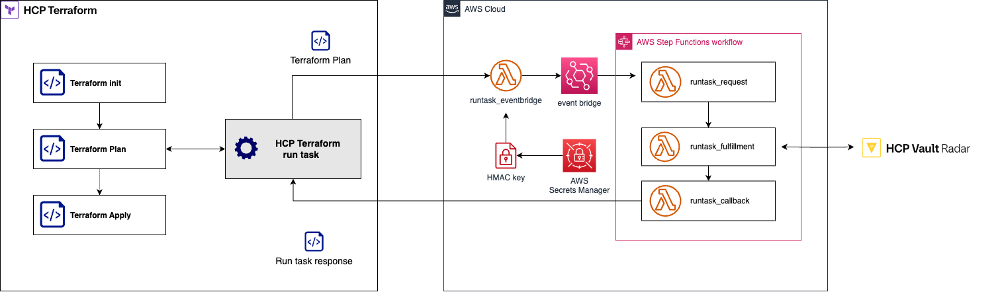

# terraform-hcp-vault-radar-runtask

This repository contains the Terraform module and python code for the Terraforn [run tasks](https://developer.hashicorp.com/terraform/cloud-docs/integrations/run-tasks) integration between [HashiCorp Vault Radar](https://developer.hashicorp.com/hcp/docs/vault-radar) and [HCP Terraform](https://app.terraform.io/public/signup/account)

The intention of this integration is to make sure that when DevOps engineers are creating Terraform runs they're not accidentally commiting their secrets, API keys, private keys and other sensitive information as part of their Terraform run.



## Prerequisites

To use this module you need have the following:

1. AWS account & credentials
1. HCP Terraform account

## Usage

1. Implement the Terraform run task logic

     * Process Terraform plan file (JSON) or config file in the `src/handler.py`
     * Create the container image and push it to a Docker registry

1. Reference the `examples/basic` folder on how to use this module

    ```sh
    cd examples/basic
    terraform init
    terraform plan
    terraform apply
    ```

## Best practice

* **Do not** re-use the Run Tasks URL across different trust-boundary (organizations, accounts, team). We recommend you to deploy separate Run Task deployment per trust-boundary.

* **Do not** use Run Tasks URL from untrusted party, remember that Run Tasks execution sent Terraform plan output to the Run Task endpoint. Only use trusted Run Tasks URL.

* Enable the AWS WAF setup by setting variable `deploy_waf` to `true` (additional cost will apply). This will add WAF protection to the Run Tasks URL endpoint.

* We recommend you to setup additional CloudWatch alarm to monitor Lambda concurrency and WAF rules.
